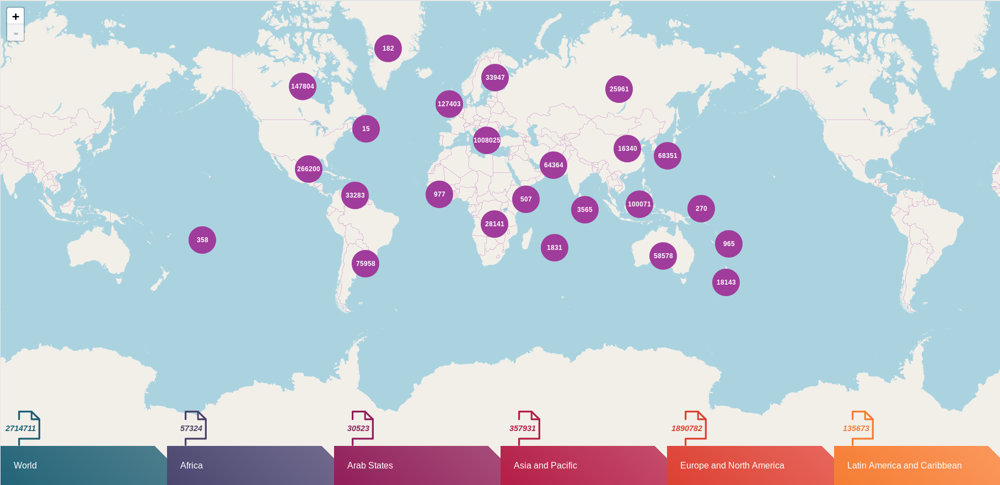

# ISSN lister

This [project](github.com/miku/issnlister) aims to provide a fairly current
[list of valid ISSN](https://git.io/Jf8sa). It was developed at the [Internet
Archive](https://archive.org/).

> ISSN-LIST-DATE: 2020-06-18 -- [download](https://git.io/Jf8sa)
> COUNT: 2144793

Publicly available metadata has been archived at:

* [https://archive.org/details/issn_public_data_20191125](https://archive.org/details/issn_public_data_20191125)

## International Standard Serial Number

[International Standard Serial
Number](https://en.wikipedia.org/wiki/International_Standard_Serial_Number), is
an eight-digit serial number used to uniquely identify a serial publication,
such as a magazine.

Issuing organisation: [issn.org](http://www.issn.org/).

> The CIEPS, also known as the ISSN International Centre, is an
intergovernmental organization which manages at the international level the
identification and the description of serial publications and ongoing
resources, print and online, in any subject.

## Variants

* E-ISSN (electronic), P-ISSN (print), ISSN-L (link)

> Conversely, as defined in ISO 3297:2007, every serial in the ISSN system is
also assigned a linking ISSN (ISSN-L), typically the same as the ISSN assigned
to the serial in its first published medium, which links together all ISSNs
assigned to the serial in every medium

## Usage

```
$ issnlister -h
Usage of issnlister:
  -b int
        batch size per worker (default 100)
  -c string
        continue harvest into a given file (implies -m)
  -d string
        path to cache dir (default "/home/tir/.cache/issnlister")
  -i string
        path to file with ISSN to ignore, one ISSN per line, e.g. ...
  -l    list all cached issn, one per line
  -m    download public metadata in JSON format
  -q    suppress any extra output
  -s string
        the main sitemap (default "https://portal.issn.org/sitemap.xml")
  -ua string
        set user agent (default "issnlister/0.1.0 (https://github.com/miku/issnlister)")
  -version
        show version
  -w int
        number of workers (default 16)
```

## Generate a new list

Update list and README with a simple `make issn.tsv` (assuming sed, awk and sort installed).

## Start a harvest or continue a harvest

With `-c` you can start or continue an interrupted harvest into the same file.

```
$ issnlister -c file.ndj
```

## Basic ISSN validation

```python
def calculate_issn_checkdigit(s):
    """
    Given a string of length 7, return the ISSN check digit.
    """
    if len(s) != 7:
        raise ValueError('seven digits required')
    ss = sum([int(digit) * f for digit, f in zip(s, range(8, 1, -1))])
    _, mod = divmod(ss, 11)
    checkdigit = 0 if mod == 0 else 11 - mod
    if checkdigit == 10:
        checkdigit = 'X'
    return '{}'.format(checkdigit)
```

## Number of ISSN

* ~2714711 (as of 2019-11-11 per website), but

Growth at about 50k to 120k updates and additions per year.

```
$ curl -sL https://git.io/Jf8sa | wc -l
2139915
```

## Upper limit of valid ISSN?

* 10^7

Current probability that a random, valid ISSN is registered: ~0.213 (2020-05-12).

## Distribution

Snapshot, 2019-11-11, 15:00, UTC+1.



## Formats

Various formats are available.

* [xml](https://portal.issn.org/resource/ISSN/2257-6754?format=xml), [json](https://portal.issn.org/resource/ISSN/2257-6754?format=json), ...

## List of ISSN

List ISSN, quietly.

```
$ issnlister -l -q
```

All data is cached
([XDG](https://specifications.freedesktop.org/basedir-spec/basedir-spec-latest.html)),
by default under `$HOME/.cache/issnlister/2019-11-11/...` where raw downloads
and combined data lives.

Alternatively:

```
$ find ~/.cache/issnlister/2019-11-20 -name 'sitemap*xml' -exec 'cat' {} \; | \
    grep 'https://portal.issn.org/resource/ISSN/[^"]*' | \
    grep -oE '[0-9]{4}-[0-9]{3}[0-9xX]' | LC_ALL=C sort -u
```

